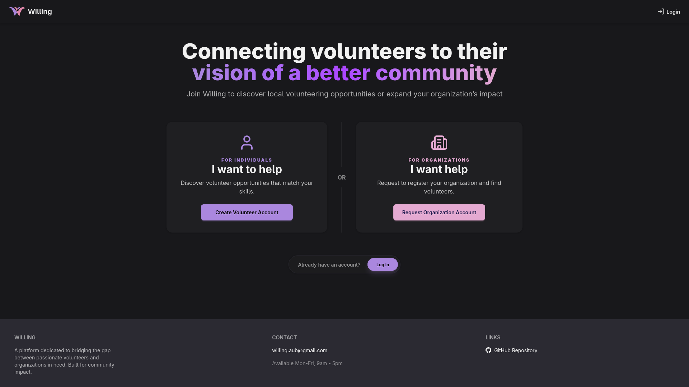

#  Willing

A platform dedicated to bridging the gap between passionate volunteers and organizations in need. Built for community impact.



## Setup

### Prerequisites
- Node.js (v18 or higher)
- Docker and Docker Compose

### Database Setup
First, start the PostgreSQL database using Docker:
```sh
cd server
docker compose up
```

### Server Setup
1. Install dependencies:
   ```sh
   cd server
   npm ci
   ```

2. Create environment configuration:
   ```sh
   cp .env.example .env
   ```
   Then edit `.env` and update the values as needed.

3. Run database migrations:
   ```sh
   npm run migrate
   ```

### Client Setup
```sh
cd client
npm ci
```

## Usage

### Start the Server
```sh
cd server
npm start
```
The server will run on `http://localhost:9090` (or the port specified in your `.env` file).

In development mode, migrations run automatically when the server starts.

### Start the Client
```sh
cd client
npm start
```
The client will run on `http://localhost:5173`.

## Tools and Technologies

This project is built using a modern frontend and backend stack with TypeScript, React, Node.js, and PostgreSQL. Below is a breakdown of the technologies and tools used.


## Frontend

- **TypeScript 🔷**  
  - Catches errors early and makes the codebase safer as it grows.  
  - Improves developer experience with autocomplete.

- **React ⚛️**  
  - Allows us to build the UI using reusable components.  
  - Helps manage state efficiently.

- **React Router 🧭**  
  - Handles navigation between pages without reloading the browser.

- **Vite ⚡**  
  - Modern build tool that makes the development server much faster.

- **Tailwind CSS / DaisyUI 🎨**  
  - Faster styling, consistent UI, and less custom CSS.

## Backend

- **TypeScript 🔷**  
  - Catches errors early and makes the backend safer.  
  - Improves developer experience with autocomplete.  
  - **Converting TS to JS:** We write `.ts` code, then run `npm start` which compiles all `.ts` files into `.js` files.

- **Node.js 🌿**  
  - Shares the same language and type system across frontend and backend.  
  - Improves consistency and reduces errors.  
  - Allows server-side execution.

- **Express 🚂**  
  - Lightweight web framework for Node.js.  
  - Helps define routes, handle requests/responses, and structure the backend efficiently.

## Database

- **Kysely 📘**  
  - TypeScript-first SQL query builder.  
  - Helps interact with PostgreSQL safely with type checking.

- **PostgreSQL 🐘**  
  - Relational database storing all data for volunteers, admins, and organizations securely and reliably.

- **Adminer 🕵️**  
  - Web-based database management tool for inspecting, querying, and managing PostgreSQL during development.

## Security

- **JWT (JSON Web Token) 🔑**  
  - Used for authentication.  
  - Backend issues a token after login/register which frontend stores and sends with requests to verify identity.

- **Bcrypt 🛡️**  
  - Hashes passwords before storing them in the database.  
  - Makes it much harder for attackers to retrieve plain-text passwords.

## Other Tools

- **Docker 🐳**  
  - Ensures the project runs the same way on every machine.  
  - Eliminates issues like different Node versions, missing dependencies, or OS differences between team members.

- **Zod** ✅  
  - TypeScript-first schema validation library.  
  - Used to validate and parse data at runtime.  
  - Ensures user inputs and API requests match expected schemas before reaching business logic.

- **GitHub Projects 📋**  
  - Used for project management and team coordination.  
  - Helps track tasks, features, bugs, and progress across the team using boards and issues.

## Database Schema
Database Schema can be found [here](https://lucid.app/lucidchart/15a30743-fdc2-4bd8-9e96-1cb2923f0955/edit?invitationId=inv_c991f4c1-95ff-4610-8ce9-994a89865101)